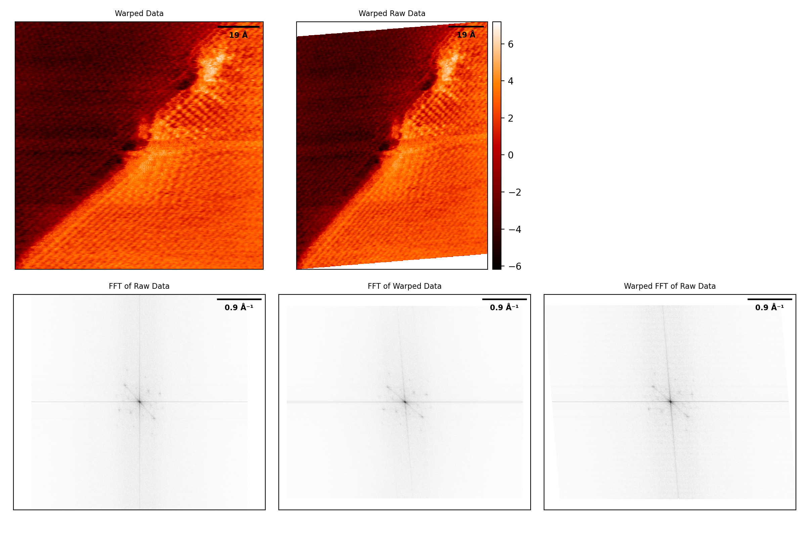

# driftcorrection
Drift correction method and linear calibration for SPM images, implemented in python, with an example file using real STM data. (c) Maxime Le Ster, 2023

## Introduction

Full paper describing the model can be found elsewhere (DOI: to be disclosed).
The python library (``driftcorrection.py``) allows to load and distort SPM images according to a measured and target lattice. The image below shows the raw data (top left), the FFT of the raw data (bottom left) and the corrected real space image (top middle), the FFT of the corrected real space image (top bottom), and the warped FFT of the raw data (bottom right).

## Dependencies

The following libraries are required (if not installed, copy/paste instructions between brackets into the terminal):

-``numpy`` (``pip install numpy``)
-``matplotlib`` (``pip install matplotlib``)
-``cv2`` (``pip install opencv-python``)

The following libraries are optional (depending on the type of image format):

-``omicronscala`` (``pip install omicronscala``) for par files
-``access2thematrix`` (``pip install access2thematrix``) for mtrx files
-``PIL`` (``pip install Pillow``) for JPG and PNG files

The extra python file ``symbols.py`` contains a list of special characters for better console and matplotlib.pyplot display.

## How to use?

Using the driftcorrection library is really straightforward. Typically it is convenient to use the following steps.
For more detail, check the example file ``exec.py``, which corrects an atomically-resolved STM image of highly-oriented pyrolithic graphite.

The SPM data can be of the following formats:

- spm
- mtrx (Omicron)
- par  (Omicron)
- jpg
- png
- txt
- npy (numpy.array)

More formats may be added at a later date.

### 1) Loading the data

The data can be loaded into a DriftCorrection object as follows:
``DriftCorrection(path)``

If the format does not contain metadata (specifying dimensions of the image), it is essential to use the following:
``DriftCorrection(path, Lx, Ly)`` with ``Lx`` and ``Ly`` the x and y dimensions of the image.

### 2) Displaying raw data

The raw data (along with the FFT) can be displayed using .ShowRaw()

### 3) Setting the raw lattice

The measured lattice can be specified using two methods:

- ``DriftCorrection.SetRawReci(K1, K2)``  with ``K1`` and ``K2`` both passed as ``tuple``, ``list`` or ``np.array`` (shape: (2,))

- ``DriftCorrection.SetRawReal(r1, r2, omega, theta)`` with ``r1``, ``r2`` sides of parallelogram, ``omega`` angle between R1 and R2, and ``theta`` angle between x-axis and R1.

### 4) Setting the target lattice

The target lattice is specified using similar methods:

- ``DriftCorrection.SetTargetReci(K1, K2)``

- ``DriftCorrection.SetTargetReal(r1, r2, omega, theta)``

### 5) Performing the transformation

The ``warpAffine`` function is embedded in a function and the transformation is achieved as follows:
``DriftCorrection.Transform()``

### 6) Displaying the results

Once the transformation is done, the results can be plot as follows:
``DriftCorrection.ShowAll()``
The details of the transformation (real and reciprocal matrices, dimensions, ...) can be printed into the console with the following command:
``DriftCorrection.PrintResults()``

### 7) Saving the data

Lastly, if satisfied with the warped image, the warped real space image and/or the warped FFT can be saved with:
``DriftCorrection.SaveData(which)``, with ``which='real'`` for real space image only, ``which='fft'`` or ``which='both'``.

## Others

If useful, please cite the following article (DOI: to be disclosed). If you have any questions or queries, please send an email to maxime.lester@fis.uni.lodz.pl (or pawel.kowalczyk@uni.lodz.pl)

